# 互联网的刻耳柏洛斯: GFW 的 DNS 审查系统

刻耳柏洛斯是希腊神话中看守冥界入口的恶犬，它允许每一个死者的灵魂进入冥界，但不让任何人出去，同时也不允许活人进入。

纽约大学石溪分校的 Nguyen Phong Hoang 和多伦多大学的 Arian Akhavan Niaki 等人，建立了一个名为 GFWatch 的网络平台，对中国网络长城（俗称 GFW）的 DNS 审查系统进行了探测和实验，最后写出了一篇论文发表在历史悠久的 USENIX（高等计算系统协会）的相关会议上。文章名为《How Great is the Great Firewall?  Measuring China’s DNS Censorship》，您可通过链接 https://www.usenix.org/system/files/sec21-hoang.pdf 获得论文原文。

在 GFWatch 工作的九个月时间里，它测试了 5.34 亿个域名。论文展示了一组触目惊心的数据：至少有 31.1 万个域名被 GFW 的 DNS 过滤系统干扰。并且 GFW 还主动出击，在世界范围内污染了公共 DNS 解析服务（public DNS resolvers）中至少 7.7 万个域名的数据，其中包括谷歌和 Cloudflare 的 DNS 解析器。

他们在论文中说：

“These techniques will not only help public DNS resolvers and other DNS-related services to sanitize tainted records , but can also assist future development of circumvention tools tobypass the GFW’s DNS censorship .”

他们的研究不仅可以帮助清除 DNS 解析器和其他 DNS 相关服务中污染了的 DNS 数据，还可以帮助今后的开发人员去开发绕过 GFW 的 DNS 审查系统的工具。

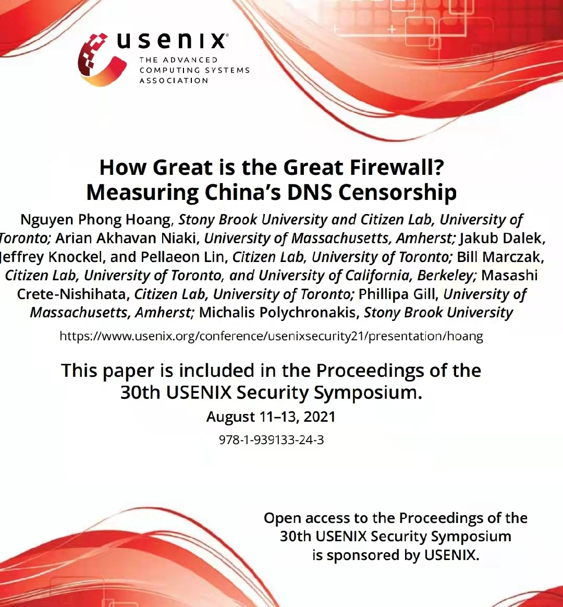

## How GFW fucks DNS

DNS （Domain Name System）的作用是根据域名查出IP地址。它是一个将域名和IP地址相互映射的分布式数据库，你可以把它想象成一本巨大的电话本。

举一个例子，如果我们要访问域名 www.baidu.com ，首先要通过 DNS 查出它的IP地址 183.232.231.172。下图是 DNS 查询的一个简单示意图。

论文中提到，由于 GFW 是一个通路的（on-path）/旁观者（man-on-the-side）的系统 ，所以它没办法通过修改或者简单丢弃互联网上传输的那些被封锁的域名的 DNS 查询响应。但是由于 DNS 使用无状态、未加密的 UDP 协议进行传输，所以 GFW 可以通过可以实时监测互联网上的流量，当在用户的 DNS 查询中检测到受审查的内容时，注入错误的响应。

由于 GFW 的相关设备通常离客户端更近（就物理/网络距离而言），所以被检测的响应通常会比合法的响应更早到达，从而达到让用户无法获得正确的域名的 DNS 的目的。

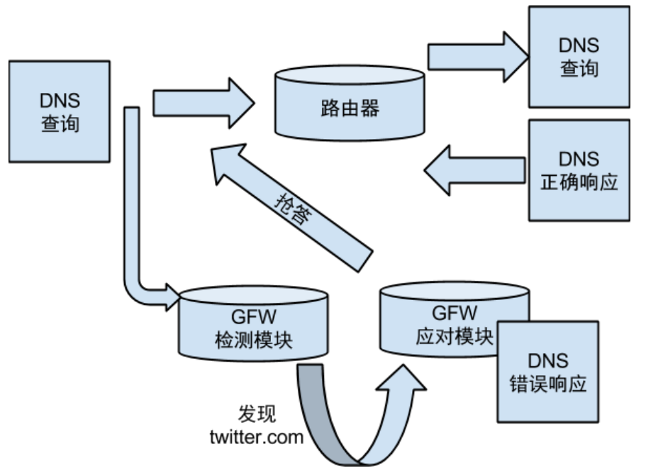

## 利器：观测 GFW 的平台 GFWatch 

> 当你凝视深渊时，深渊也在凝视着你。

GFWatch 的设计要求中，有一点就是要可以探测到尽可能多的被 GFW 阻断的网站。GFWatch 从 超过 1500 个TLD zone file 处获得实时更新的域名列表，平均每天会对 4.11 亿个网站进行监测，截至 2020 年总共探测了 5.34 亿个网站。发现至少有 31.1 万个域名被 GFW 的 DNS 过滤系统干扰。

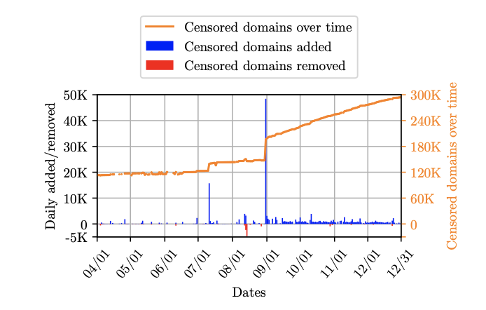
GFWatch 同时被设计以可以实行长期探测。一旦它探测到某个网站被封锁，GFWatch就会持续对这个网站进行观测，观察这个网站是否会在某个时间点被 GFW 解封。

同时，GFWatch 还被设计来收集统计 GFW 返回的虚假 IP 地址。

接下来我们来看看 GFWatch 的实验和探测手段。

GFWatch 的主要探测器位于没有 DNS 审查制度的美国，从这台机器发送 DNS 查询消息前往位于中国的两台主机。但是位于中国的那两台主机并没有 DNS 解析能力，因此，主探测器的任何 DNS 响应都应该是来自 GFW。

因为 DNS query 使用 UDP，所以 GFWatch 也被设计为使用 UDP 进行探测。而 UDP 是一个无状态和不可靠的协议，数据包可能会由于不受控制的因素（例如，网络拥堵）而丢失。为了尽量减少这些因素对数据收集的影响，GFWatch 每天至少对每个域名进行三次测试。

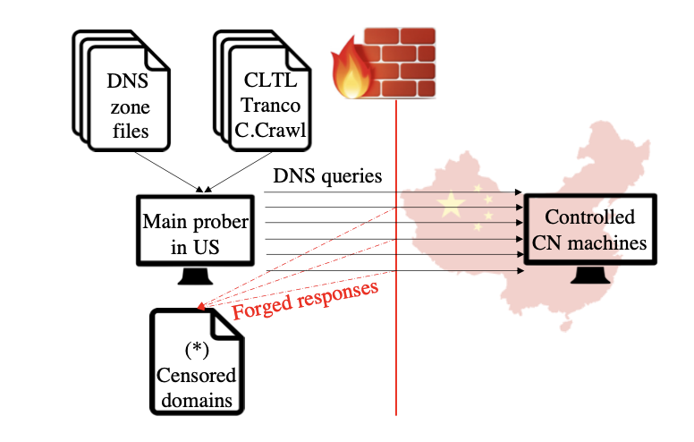

很妙的一个实验方法！一个优秀的猎手往往以猎物的姿态存在。虽然你耗费了电费和带宽，但是你可是钓上了 GFW 这条大鱼啊！

中国的两台主机位于两个不同的自治系统（AS）中。但是从探测结果来看，发往这两台中国主机的 DNS 查询所接受的封锁政策是相同的，故研究人员猜测 GFW 应该是采用中心化政策（centralized blocking policy）的一个系统。

在位探测仪完成每个探测批次后，被检测到的受审查域名被转移到中国主机上，

接着，研究人员又控制位于中国境内的主机向位于美国的主机发送网站的 DNS 查询信息。研究人员观察到从美国发往中国的 DNS 查询时会被审查的域名在中国发往美国时同样会被审查。

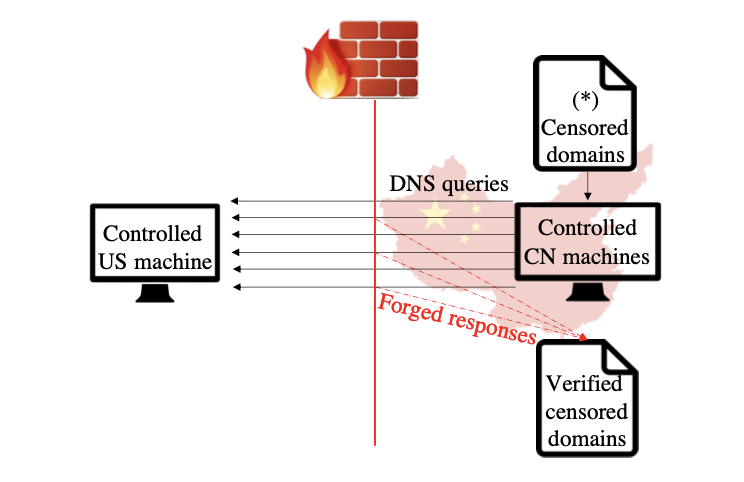

通过两个探测路径探测到了相同的被审查的域名名单。

截至论文发表时，GFWatch 仍在运行，每天都在收集数据。

## 从 GFW 封锁网络清单中反推规则

> 论多么天衣无缝的犯罪，只要是人作的，就没有解不开的道理。
> ——阿瑟·柯南·道尔《福尔摩斯全集》

如果 subdomain.example.com 和 example.com 的所有子域都被封锁，研究人员就将 example.com 视为一个被封锁的域名（blocked domain）。最短的审查域名便称为 "基础域名"（base domain）。通过对 GFWatch 发现的 31.1 万个被审查的域名进行分析，研究人员发现了 13.87 万个基础域名。截至 2020 年 12 月 31 日，仍存在 12.6 万个被封禁的基础域名。

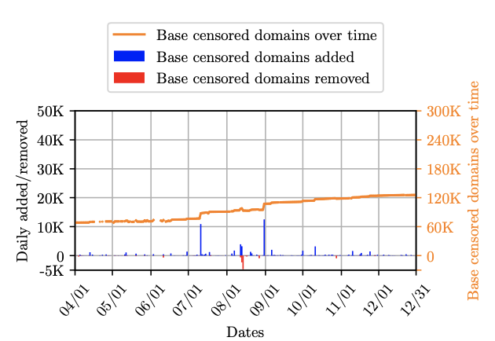

但是研究人员同时注意到，当一个子域名被封锁时，基础域名可能不会被封锁。例如，cs.colorado.edu 被封锁了，而 colorado.edu 没有被封锁，这说明 GFW 没有简单地采用一刀切的封锁措施。于是研究人员进一步的进行了分类，对于一个给定的域，研究人员测试了每个审查的域和随机字符串的以下排列组合。

- Rule 0  censored_domain
- Rule 1  censored_domain{.rnd_str}
- Rule 2  censored_domain{rnd_str}
- Rule 3  {rnd_str.}censored_domain
- Rule 4  {rnd_str}censored_domain
- Rule 5  {rnd_str.}censored_domain{.rnd_str}
- Rule 6  {rnd_str.}censored_domain{rnd_str}
- Rule 7  {rnd_str}censored_domain{.rnd_str} 
- Rule 8  {rnd_str}censored_domain{rnd_str}

在 138.7 万个基础域名中，有 11.8 万个域名根据规则 0 进行是独立审查的。换句话说，这些域名是被审查的，但在与随机字符串连接时不会触发GFW的DNS审查。

在这些规则中，只有规则 1 和 3 是基础域名的子域名的正确存在形式。研究人员把规则 1、3 以外的规则与较短的域名字符串组合在一起的被审查的域名称为被过度封锁（overblocked）的域名。

按照封锁严重程度的升序，研究人员发现在规则2、3、4、6和8下，分别有4、11.38 万、1.09 万、1400 个和 696 个不同的基础域名被封锁。

### 对 GFW 过度封锁的研究

有超过 1.3 万个基础域名被过度封锁。在发现的 33.1 万个被审查的域名中，有 41000 个域名是过度封锁的。

论文中举了一个例子：GFW 将 torproject.org 进行了严格审查，对其进行了过度封锁（overblocked）。包括 mentorproject.org 在内，任何包含了 torproject.org 字段的网站都被 GFW 封锁，令人啼笑皆非。（Tor 是一个旨在实现匿名通信的自由软件（free software），Tor 用户的互联网活动相对较难追踪。）

919.com、jetos.com 和 33a.com 这三个域名共造成15000个不相关的域名被过度封锁，如果有朋友打算购买域名，请注意避开包含有相关子字符串的域名。以避免被 GFW 不明不白的封锁了。

### 对被封域名种类的研究

研究人员使用了 FortiGuard 提供的服务，进行域名分类。

统计发现，"商业"（business）、"色情 "（pornography）和 "信息技术 "（information technology）这三种网站是 GFW 封锁的主要类型（除了未分类的网站外）。

另外一项没有没有统计子域名的研究则发现，"代理"（proxy avoidance）和 "个人网站和博客"（personal websites and blogs）是被封锁最多的网站类型。

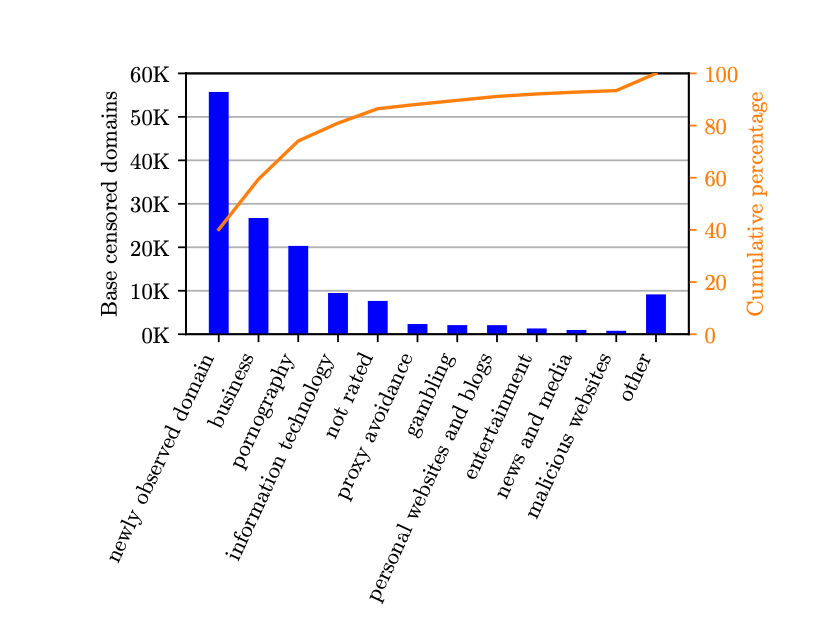

虽然 "教育" 不是被审查的首要类别，但研究人员同时发现了许多与教育有关的域名被封锁，包括 mit.edu、umich.edu、gwu.edu、armstrong.edu、brookings.edu、citizenlab.ca、feitian.edu、languagelog.ldc.upenn.edu、pori.hk、soas.ac.uk、 scratch.mit.edu、cs.colorado.edu……

这是 GFW 滥封网站的又一个证据。

### COVID-19、自动化工具与雇员  

GFWatch 检测到大量与 COVID-19 有关的域名被 GFW 通过 DNS 篡改进行审查，包括 covid19classaction.it、covid19song.info、covidcon.org、ccpcoronavirus.com、covidhaber.net以及covid-19truth.info 等网站。

虽然大多数 COVID-19 相关的网站在出现后很快被 GFW 发现并封锁，但研究人员发现 GFW 无法做到实时封禁相关网站。

ccpcoronavirus.com 和 covidhaber.net 于 2020 年 4 月首次出现在 GFWatch 的测试列表上，但分别直到 7 月和 9 月才被 GFW 封杀。同样的，covid-19truth.info 在 2020 年 9 月出现在研究人员的数据集中，但直到 10 月才被审查。

*GFW 审查不同域名所需时间的巨大差异表明，封锁网站名单很可能是由自动工具和人工共同完成的。*

## 伪造的 IP 与被蒙蔽的人们

> 真理是永远蒙蔽不了的。

了解 GFW 伪造的 IP 和它们被注入的模式（如果有的话）是至关重要的。

研究人员分析了 GFWatch 收集的 IP，以研究是否存在任何特定的注入模式，在此基础上，我们可以制定策略来有效地检测和绕过 GFW 的 DNS 审查制度。

### 伪造的 IP 的数量随时间流逝增加

研究人员从 GFWatch 捕获的所有中毒的 DNS 响应中发现了 1781 和 1799 个伪造的 IPv4 和 IPv6 地址。

研究人员发现所有被 GFW 注入的 IPv6 地址都是假的，因此，研究人员把分析的重点放在伪造的IPv4地址上。

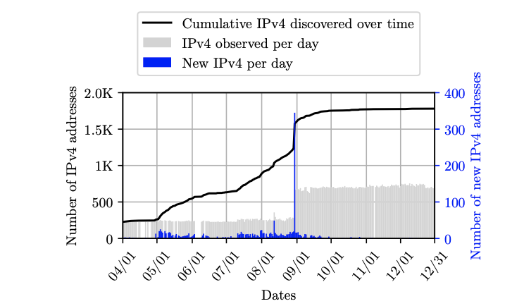

从 2020 年 5 月份开始，GFWatch 监测到 GFW 使用的伪造 IP 数量开始增多，在2020年的最后四个月，伪造的 IP 数量增长到 1700 个左右。

### 有迹可循：伪造 IP 的注入模式

通过分析每个伪造 IP 地址的注入频率，我们发现并不是所有的伪造 IP 都有同样的机会被注入到被审查的回应中，也就是说，他们的注入模式并不是完全随机的。

尽管 GFW 伪造的 IP 数量迅速增加，但最初的 200 个伪造的 IP 仍然对 99% 的 DNS 注入负责。从 5 月到 8 月发现的新的的 1300 个伪造 IP 位于长尾部分，研究人员只在 1% 的 GFW 伪造的 DNS 响应中发现了它们。

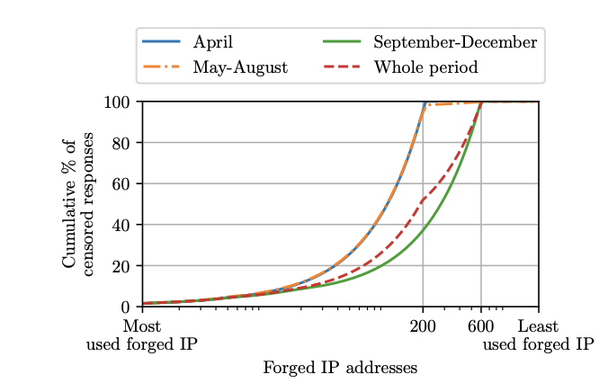

根据这一试验结果，我们或许获得了些许反制 GFW DNS 污染的灵感。

## 围城：双向拦截

>城外的人想进去，城里的人想出来

因为有时 DNS 查询的信息不可避免的会经过中国网络，触发 GFW 的双向 DNS 过滤行为，故先前研究人员曾认为 这是中国境外的公共 DNS 解析器缓存被污染的原因。

经过进一步的研究，研究人员发现许多域名的权威名称服务器（authoritative name servers）位于中国境内是另一个主要原因，这些中毒的 DNS 缓存借此玷污了世界各地的许多公共 DNS 解析器。

GFWatch 发现的被审查的域名和 GFW 伪造的 IP 的数据集有助于检测和净化公共 DNS 解析器缓存中的中毒资源记录。

### GFW 对中国域名的地理封锁

2020 年 8 月 8 日，GFWatch 检测到 GFW 一个奇怪的封锁行为：GFW 对中国政府网站进行了审查阻断。

www.beian.gov.cn 名为“全国互联网安全管理服务平台”，由中国工业和信息化部管理。这个域名有两个权威的名称服务器，dns7.hichina.com 和 dns8.hichina.com，它们被托管在 16 个不同的中国境内的 IP 地址上。一旦在中国境外发出向针对该网站的 DNS 查询，GFW 便会对查询进行污染与注入。但位于中国境内的主机仍然可以正常访问这个网站。

因此，这是一个明显的地理封锁案例。GFW 不仅仅封堵了主机从中国向境外被审核网站的访问，也污染了境外主机向中国境内部分网站访问时的 DNS 查询。

从中国境外访问 www.beian.gov.cn 会间歇性地成功，因为 GFW 的 DNS 注入有时会比正确的响应更晚到达使用终端。

### GFW 大炮

研究人员提到了 GFW 发动资源耗尽攻击（resource exhaustion attacks）的可能性。 一旦 GFW 将 DNS 查询的结果大量导向某个 IP 地址，受影响的组织将在服务器上付出不可忽视的开销。

GFW 甚至可以针对一个 DNS 查询发出多达三个伪造响应。从GFW的角度来看，注入多个虚假响应不仅增加了成功污染查询结果的可能性，也使检测和规避 DNS 污染的成本增高，难度增大。

## 如烛者，思至则见，不思不见

> 你就是这道黑暗中强烈的光束，从属于你的夜晚中，照亮了他们曾经看不见的白天。
> ——爱德华·勒维

一旦 GFWatch 检测到有域名被 GFW 封锁，研究人员就向公共的 DNS 解析器查询它们。最终，研究人员发现了公共 DNS 解析器的缓存中，有 7.7 万个被 GFW 审查的域名被污染。下图显示了数据被污染得最多的前十个公共 DNS 解析器。

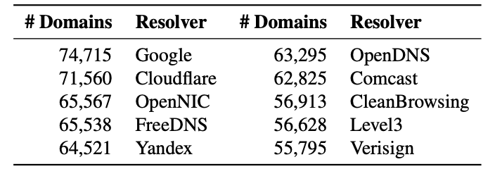

这一发现显示了 GFW 在世界范围内的广泛影响，使得公共的 DNS 解析器的操作者必须有一个有效的机制来防止这些中毒的资源记录污染他们的缓存，以保证他们的DNS服务质量。

现在，研究人员将展示如何根据前文展示的 GFW 的特点和 GFWatch 获得的浩如烟海的数据制定策略，以有效和高效地规避GFW的DNS审查制度。

当收到一个以上的 IPv6 回应时，客户端可以根据 GFW 伪造的 IPV6 的显著特点排除掉被污染的 IP 地址。对于 IPv4 答案，客户端可以根据前文中发现的 GFW 伪造 IP 的注入模式和伪造的 IPv4 特点来检查它们。

从下图中，我们可以看到 99% 的被 GFW 污染的 DNS 响应比正确的响应提前 364ms 到达我们的机器（这个延迟时间根据终端和 GFW 之间的相对距离的不同而可能会有所不同）。换句话说，在查询一个受审查的域名 IP 时，收到 GFW 设备发出的 DNS 响应时，客户端最多应该多等 364ms，以等待正确 IP 的到来。

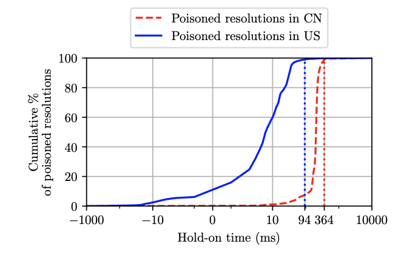

## 愿我们能够在没有黑暗的地方相遇

> 人类收到火的礼物之后，国王会用它征服世界，厨师会用它喂养世界，工程师会用它移动世界。小丑只会用它玩杂耍。

研究团队开发了 GFWatch，监测并统计了 GFW 基于 DNS 审查的封锁行为。然而，DNS 审查并不是 GFW 使用的唯一的封锁技术，还有其他许许多多的技术被采用来防止信息在互联网间自由的流通。例如，基于 SNI 的封锁、基于关键字的过滤、针对特定 IP 的封锁、使用深度包监测识别异常流量……

今后我也会继续关注这方面的内容，但是在顺利前去留学之前（现大三在读），我会尽可能的专注于学习。同时，由于撰写这篇文章时时间仓促，也因为我本人学术水平有限，如有错讹，欢迎您和我联系。

您可以通过以下方式找到我：
- GitHub：https://github.com/Yangxiamao
- Twitter：https://twitter.com/real_Peter_Yang 
- Telegram Channel：https://t.me/peter_thing 

本篇文章以 MIT 协议开源，欢迎任何人转载、引用。祝您生活愉快、学业、事业顺利。
